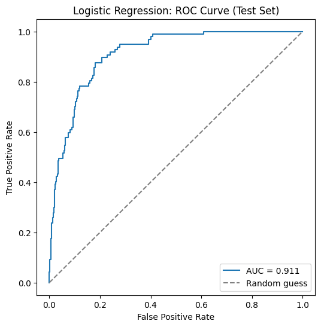
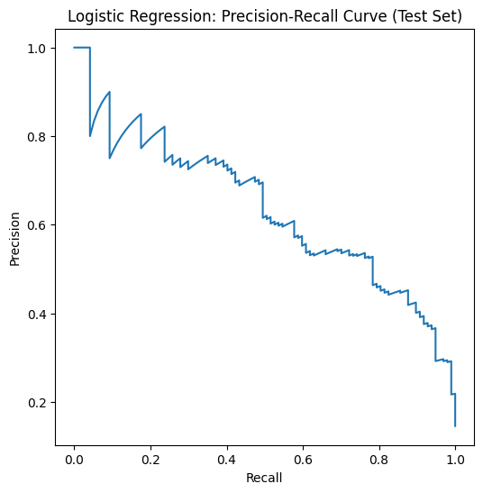
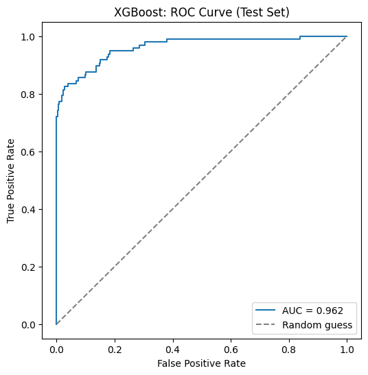
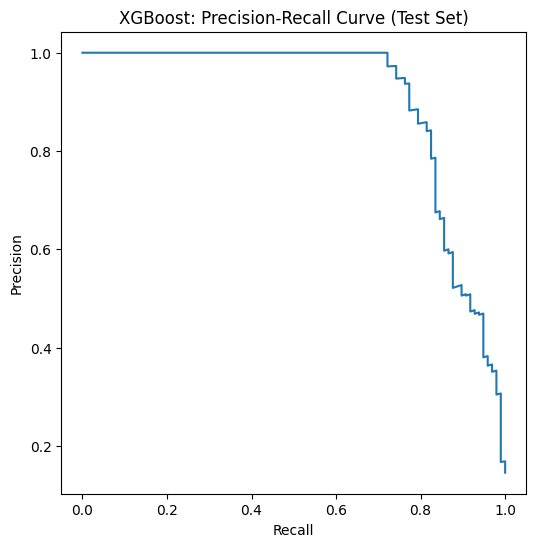
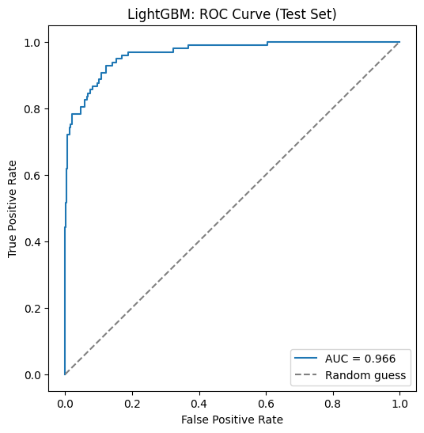
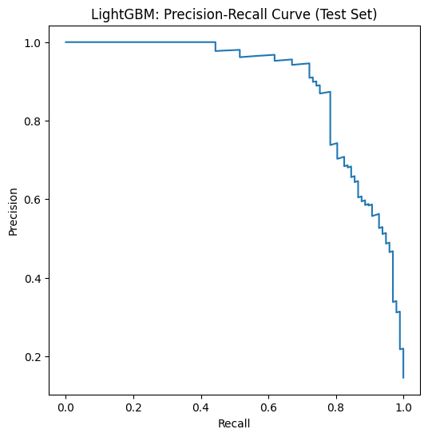
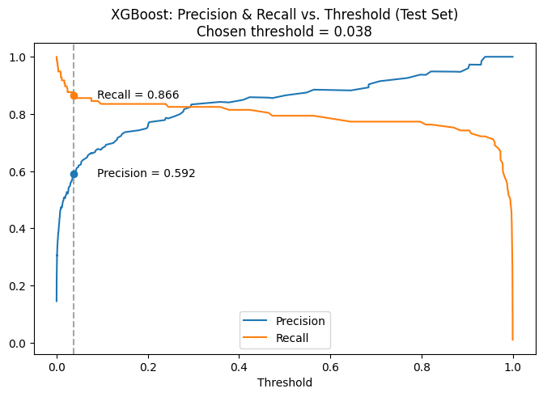
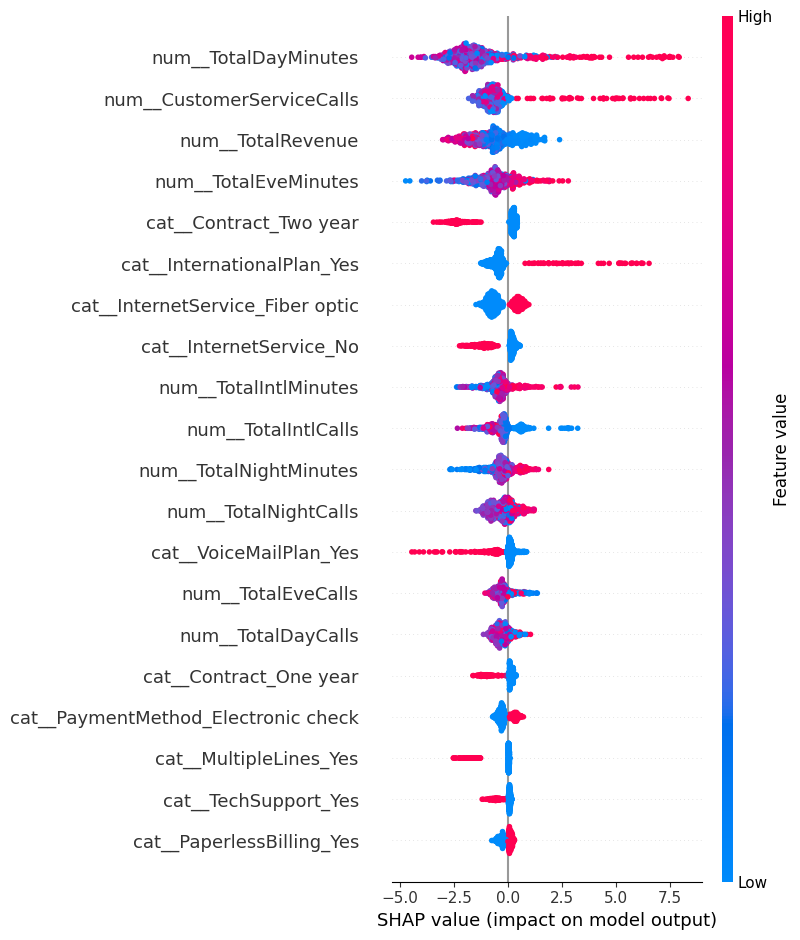
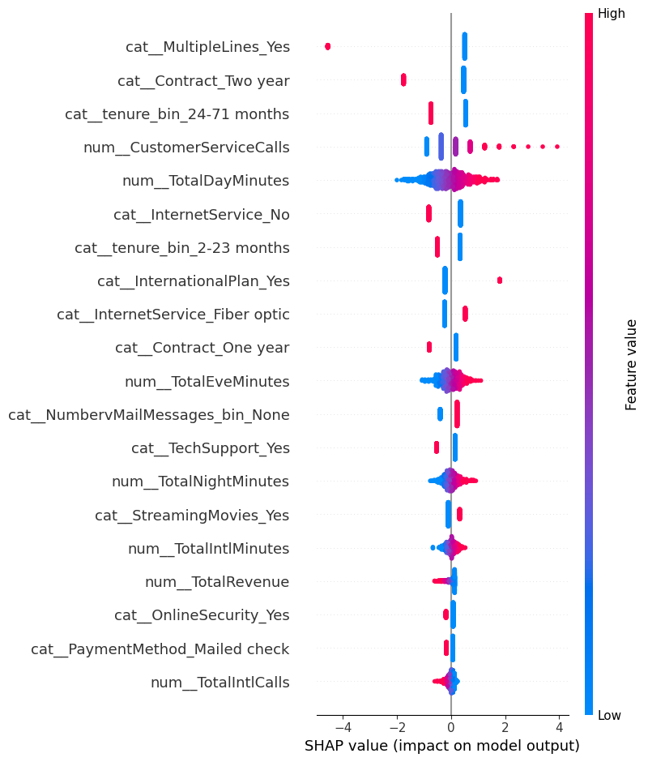

# Customer Churn Prediction

An end-to-end machine learning project that predicts whether a telecom customer is likely to churn — from exploratory data analysis and model training through to a containerized, cloud-deployed prediction API with a web UI.

## Overview

- **Dataset**: [Telco Churn dataset](https://www.kaggle.com/datasets/blastchar/telco-customer-churn)-style data — 3,333 customers, 33 columns (demographics, account details, service usage, billing), binary target `Churn` (Yes/No).
- **Class balance**: 14.5% churn rate (483 churners / 3,333 customers) — a meaningfully imbalanced classification problem, which shaped several modeling decisions below.
- **Goal**: predict churn probability per customer, with a deliberate lean toward **recall** (catching churners) over precision, since in a real business the cost of missing a churner (lost revenue) generally outweighs the cost of a false alarm (an unnecessary retention offer).

## Project workflow

### 1. EDA and a data leakage lesson

Initial exploratory analysis (`eda.ipynb`) was done *before* the train/test split, including checking feature-target relationships and multicollinearity (VIF). This was later identified as a mild form of data leakage — any analysis that looks at how a feature relates to the target should happen only on the training split, otherwise information from the test set quietly leaks into modeling decisions. All EDA in the final workflow (`sample-main.ipynb`) is now done strictly after `train_test_split`.

### 2. Preprocessing pipeline

Built as an `sklearn` `Pipeline` (`preprocessing.py` + `ColumnTransformer`), so the exact same transformations apply identically at training and prediction time:

- Cleans and coerces `TotalRevenue` (handles non-numeric entries)
- Drops columns with no predictive value (`customerID`, `PhoneService`, `TotalCall`)
- Collapses redundant categories (e.g. `"No internet service"` → `"No"`)
- Bins `NumbervMailMessages` and `tenure` into interpretable ranges
- One-hot encodes categoricals; **standard-scales** numeric features for the linear model, but leaves them unscaled (`passthrough`) for the tree-based models, which don't need scaling

### 3. Model training and tuning

Three models were trained and tuned via `GridSearchCV` (5-fold stratified CV), all optimized on a **custom F2 score** (`fbeta_score(beta=2)`) rather than plain accuracy or recall — F2 weights recall twice as heavily as precision, which fits the business goal of prioritizing catching churners, without going as extreme as optimizing for recall alone (which would trivially push the threshold toward flagging everyone).

| Model | Best hyperparameters | CV F2 score |
|---|---|---|
| Logistic Regression | `C=1, penalty=l1, solver=liblinear, class_weight=balanced` | 0.707 |
| XGBoost | `max_depth=7, scale_pos_weight=10` | 0.827 |
| LightGBM | `max_depth=5, scale_pos_weight=10` | 0.820 |

### 4. Test set performance

Evaluated once, on a held-out test set the models never saw during training or tuning:

| Model | Accuracy | Precision | Recall | F1 | ROC-AUC |
|---|---|---|---|---|---|
| Logistic Regression (tuned) | 0.823 | 0.442 | 0.825 | 0.576 | 0.911 |
| XGBoost (tuned) | 0.952 | 0.865 | 0.794 | 0.828 | 0.962 |
| LightGBM (untuned baseline) | 0.957 | 0.947 | 0.742 | 0.832 | 0.968 |
| LightGBM (tuned) | 0.928 | 0.729 | 0.804 | 0.765 | 0.966 |

A few things worth noting:
- **Logistic regression** achieves the highest recall but at a steep precision cost — useful as an interpretable baseline, less so as a deployment candidate.
- **Tuning LightGBM for F2** visibly trades precision for recall compared to its untuned baseline (0.947 → 0.729 precision, 0.742 → 0.804 recall) — a direct, measurable illustration of what optimizing for a recall-weighted metric actually does to a model.
- **XGBoost** was ultimately chosen for deployment: the best balance of precision and recall among the F2-tuned models, plus the second-highest ROC-AUC (0.962), meaning it separates churners from non-churners cleanly across every possible threshold — which mattered for the next step.

### 5. ROC and Precision-Recall curves (test set)

<table>
<tr>
<td></td>
<td></td>
</tr>
<tr>
<td></td>
<td></td>
</tr>
<tr>
<td></td>
<td></td>
</tr>
</table>

### 6. Threshold selection

The default classification threshold (0.5) is arbitrary — it doesn't know anything about the business's actual tolerance for false positives vs. false negatives. Instead, the deployed XGBoost model's threshold was chosen by directly reading the precision-recall tradeoff off the test set curve:



**Deployed threshold: 0.038** (vs. the default 0.5) — chosen to push recall to ~86.6% (precision ~59.2%), reflecting a deliberate business tradeoff: flag more borderline customers as at-risk, accepting more false alarms in exchange for catching more actual churners.

### 7. Explainability (SHAP)

To go beyond "the model predicts X" and explain *why*, SHAP (SHapley Additive exPlanations) was used to attribute each prediction to individual feature contributions:

- **`TreeExplainer`** for the tree-based models (XGBoost, LightGBM) — exact, efficient Shapley values for tree ensembles.
- **`LinearExplainer`** for logistic regression — the appropriate SHAP explainer for linear models, using the training data's feature averages as the baseline.

<table>
<tr>
<td></td>
<td></td>
</tr>
</table>

### 8. Statistical significance (Wald test)

Beyond feature importance, `statsmodels.Logit` was used to run a Wald significance test on the logistic regression coefficients — answering "is this feature's effect on churn statistically significant, or could it be noise?" (p < 0.05 treated as significant). This step also surfaced two real data issues during debugging: a perfectly collinear feature pair and two features exhibiting perfect separation (a subcategory where 100% of customers fell into a single class) — both excluded from the significance test, and both consistent with earlier SHAP findings about the same features.

## Deployment

```
┌─────────────────┐      predict       ┌──────────────────────┐
│  Streamlit UI    │ ──────────────────▶│   FastAPI + XGBoost   │
│  (local)          │                     │   (Docker, on Render) │
│                    │◀──────────────────  │                        │
└─────────────────┘   probability        └──────────────────────┘
```

- **API** (`api/`): a FastAPI service wrapping the tuned XGBoost pipeline. Validates requests with Pydantic, returns a churn probability and a boolean prediction at the deployment threshold. Containerized with Docker, using a dynamic `PORT` (via `${PORT:-8000}`) so it runs the same way locally and on a cloud host.
- **Hosting**: deployed on [Render](https://render.com)'s free tier, built directly from the `api/Dockerfile`.
- **Frontend** (`streamlit_app.py`): a form-based UI so predictions don't require hand-editing JSON — fills in customer details, calls the API, and displays the churn probability and prediction. Currently run locally, pointed at the API; deploying it to Streamlit Community Cloud is a planned next step.
- **Logging**: every prediction (inputs + output) is appended to `prediction_logs.jsonl` in JSON Lines format — a lightweight, append-only audit trail of what the model was asked and what it answered.

## Project structure

```
Churn-Practice/
├── sample-main.ipynb          # main analysis + modeling notebook
├── eda.ipynb                  # exploratory data analysis
├── preprocessing.py           # shared preprocessing functions (importable module)
├── streamlit_app.py           # Streamlit frontend
├── prediction_logs.jsonl      # append-only log of live predictions
├── docs/images/                # exported graphs used in this README
└── api/
    ├── app.py                 # FastAPI app
    ├── preprocessing.py       # copy of preprocessing.py (needed in the Docker build context)
    ├── requirements.txt
    ├── Dockerfile
    ├── xgb_pipeline.joblib     # fitted preprocessing pipeline
    └── xgb_best_model.joblib   # tuned XGBoost model
```

## Running locally

**API (Docker):**
```bash
cd api
docker build -t churn-api .
docker run -d -p 8000:8000 --name churn-api churn-api
curl http://localhost:8000/health
```

**Streamlit UI:**
```bash
pip install streamlit requests
streamlit run streamlit_app.py
```
The UI expects the API at `http://localhost:8000` by default.

## Tech stack

Python · pandas · scikit-learn · XGBoost · LightGBM · statsmodels · SHAP · FastAPI · Pydantic · Docker · Streamlit · Render
